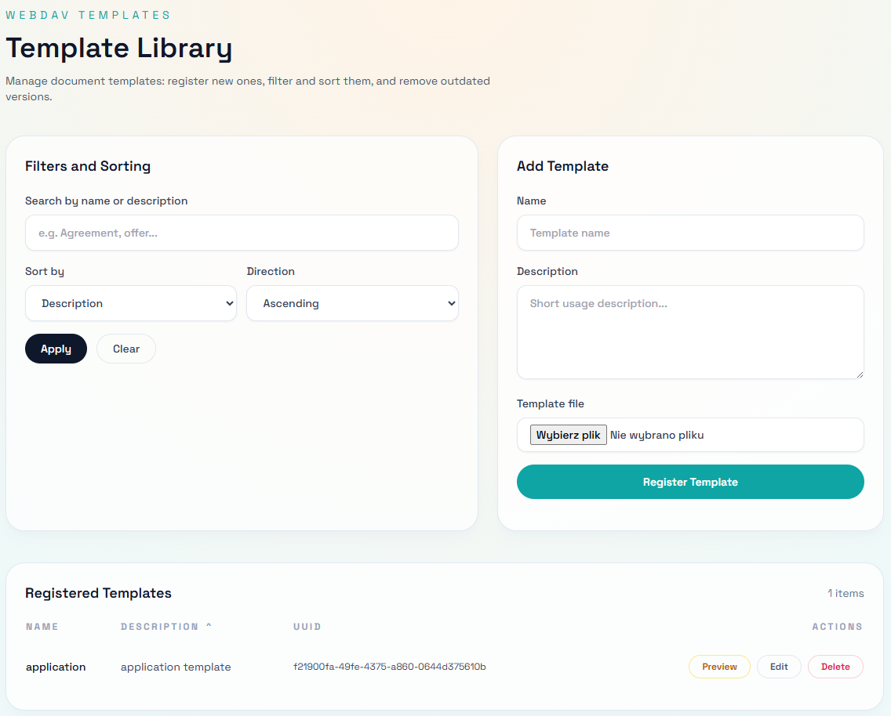

# WebDAV Templates

This Spring Boot 3 application exposes `DOCX` document templates over WebDAV, allows direct editing in Microsoft Word, and generates PDF previews on demand. Template metadata is stored in a database, while the actual document files are stored on disk.



## Project Goal

The project implements a Word template workflow:

- an administrator registers a `DOCX` template in the application,
- a user opens it in Microsoft Word through an `ms-word:ofe|u|...` link,
- Word saves changes back through WebDAV,
- the application keeps the current file version and exposes a live PDF preview.

This design separates:

- template metadata: H2 database through JPA,
- binary document content: `UUID.docx` files in a storage directory,
- management UI: a Thymeleaf-based web interface,
- external editing: a Milton WebDAV servlet mounted under `/webdav/*`.

## Architecture and Design

### Technology Stack

- Java 17
- Spring Boot 3.2.5
- Spring MVC + Thymeleaf
- Spring Data JPA
- Flyway
- H2
- Milton WebDAV Servlet
- docx4j + Apache FOP
- Batik and FreeHEP for converting WMF/EMF images to PNG before PDF generation

### Main Components

`TemplateController`

- handles the main screen at `/`,
- displays the template list with filtering and sorting,
- accepts new template uploads through `POST /templates`,
- deletes templates through `POST /templates/{id}/delete`,
- builds `baseUrl`, which is used for the Microsoft Word WebDAV edit link.

`DocumentTemplateService`

- manages template listing,
- stores uploaded `DOCX` files in the configured storage directory,
- deletes files from disk,
- resolves file paths and returns the last modification timestamp.

`DocumentTemplate` and `DocumentTemplateRepository`

- the `document_template` entity stores `id`, `name`, and `description`,
- the database enforces a unique index on template name,
- the repository supports search by name and description.

`TemplatePreviewController`

- generates PDF on the fly through `GET /templates/{id}/preview`,
- exposes preview refresh metadata through `GET /templates/{id}/preview-meta`,
- converts `EMF/WMF` metafile images to `PNG` before PDF rendering to improve compatibility.

`WebDavServletConfig`

- registers the Milton servlet under `/webdav/*`,
- points Milton to the custom `ResourceFactory`.

`WebDavResourceFactory`

- maps WebDAV paths to Milton resources,
- exposes the root collection, the `templates` collection, and individual `UUID.docx` files.

`RootCollectionResource`, `TemplatesCollectionResource`, `TemplateFileResource`

- define the WebDAV resource tree visible to clients,
- expose file read and write operations,
- implement in-memory WebDAV locking,
- currently authorize every request as anonymous access.

### Data Model and Storage

The database contains the following table:

```sql
document_template(id UUID PRIMARY KEY, name VARCHAR(255) NOT NULL, description VARCHAR(1000))
```

Document files are stored outside the database:

- default directory: `./data/templates`
- file name pattern: `{uuid}.docx`

Default database:

- H2 file database: `jdbc:h2:file:./data/webdav`

### Processing Flow

1. A user uploads a template through the web form.
2. The application stores template metadata in the `document_template` table.
3. The `DOCX` file is written to the storage directory using a UUID-based file name.
4. The web UI exposes an `Edit` link that opens Word through `ms-word:ofe|u|{baseUrl}/webdav/templates/{uuid}.docx`.
5. Microsoft Word reads and writes the document through WebDAV.
6. `TemplateFileResource.replaceContent(...)` overwrites the file on disk.
7. A PDF preview is generated on demand from the current `DOCX`.
8. The web page polls `preview-meta` every 2 seconds and reloads the iframe when the file modification timestamp changes.

### Current Limitations

- no authentication or authorization for either HTTP or WebDAV,
- WebDAV locks are kept only in JVM memory and are not shared across instances,
- WebDAV updates overwrite the file but do not version changes,
- PDF preview generation is synchronous on every request,
- upload and delete errors are reported with generic UI messages only.

## User Guide

### Main Screen

When opening `/`, the user gets:

- a list of registered templates,
- search by name and description,
- sorting by name or description,
- a form for uploading a new template,
- `Preview`, `Edit`, and `Delete` actions.

### Uploading a Template

1. Open the main page.
2. In the `Add template` section, enter the name.
3. Optionally provide a description.
4. Select a `DOCX` file.
5. Submit the form.

Application-level validation requires:

- a non-empty name,
- an uploaded file.

### Searching and Sorting

The template list supports:

- `q` for filtering by name and description,
- `sort=name|description`,
- `dir=asc|desc`.

Example:

```text
http://localhost:8080/?q=agreement&sort=name&dir=asc
```

### PDF Preview

The `Preview` button:

- opens a modal dialog with an embedded PDF,
- loads the document from `/templates/{id}/preview`,
- refreshes automatically when the `DOCX` file changes after a save from Word or another WebDAV client.

### Editing in Microsoft Word

The `Edit` button uses:

```text
ms-word:ofe|u|http://host:port/webdav/templates/{uuid}.docx
```

User-side requirements:

- Microsoft Word installed with support for the `ms-word` URI scheme,
- network access to the application,
- a correct public application URL; if the app is behind a reverse proxy, the visible user-facing address must match what the server builds.

Manual access through a WebDAV client is also possible at:

```text
http://host:port/webdav/templates/
```

### Deleting a Template

The `Delete` action:

- removes the database record,
- removes the `{uuid}.docx` file from the storage directory.

## API and Endpoints

### HTTP

- `GET /` - template list and management form
- `POST /templates` - upload a new template
- `POST /templates/{id}/delete` - delete a template
- `GET /templates/{id}/preview` - generated PDF
- `GET /templates/{id}/preview-meta` - preview refresh metadata

### WebDAV

- `GET/PROPFIND /webdav/`
- `GET/PROPFIND /webdav/templates`
- `GET/PUT/LOCK/UNLOCK ... /webdav/templates/{uuid}.docx`

## Deployment Guide

### Requirements

- JDK 17
- Maven 3.9+ or a compatible Maven wrapper
- a filesystem location with write access for application data

### Local Run

Compile:

```bash
mvn clean compile
```

Start the application:

```bash
mvn spring-boot:run
```

By default, the application uses:

- database: `./data/webdav`
- document storage directory: `./data/templates`

### Build Artifact

```bash
mvn clean package
java -jar target/webdav-0.0.1-SNAPSHOT.jar
```

### Configuration

Default configuration in `src/main/resources/application.yml`:

```yaml
spring:
  datasource:
    url: jdbc:h2:file:./data/webdav;DB_CLOSE_DELAY=-1;DB_CLOSE_ON_EXIT=FALSE
    username: sa
    password:
app:
  templates:
    storage-path: ./data/templates
```

Most relevant properties:

- `spring.datasource.url` - database connection URL
- `spring.datasource.username`
- `spring.datasource.password`
- `app.templates.storage-path` - directory used to store `DOCX` files

Example override through JVM arguments:

```bash
java -jar target/webdav-0.0.1-SNAPSHOT.jar ^
  --spring.datasource.url=jdbc:h2:file:/opt/webdav/db/webdav ^
  --app.templates.storage-path=/opt/webdav/templates
```

### Database Migrations

The database schema is created by Flyway on startup. The project currently provides:

- `V1__create_document_template.sql`

### Production Deployment

For production, make sure to provide:

- persistent storage for the database and `storage-path`,
- backup for both the database and `DOCX` files,
- a reverse proxy with TLS termination,
- correct host and port forwarding if `ms-word` links must resolve to the public address,
- monitoring for PDF generation time and conversion failures,
- restricted access, since the current implementation does not require login.

### Reverse Proxy and Public URL

`TemplateController` builds the base URL from the incoming HTTP request. In practice, when running behind a proxy, headers such as the following must be forwarded correctly:

- `Host`
- `X-Forwarded-Proto`
- `X-Forwarded-Port`

Otherwise, the `Edit` link may point to an internal address instead of the public one.

### Security

In the current implementation:

- WebDAV resources accept every request,
- the web UI has no login,
- upload validation only checks presence, not actual file type.

Before using this in production, at minimum add:

- user authentication,
- authorization for template access,
- file type and file size validation,
- HTTPS transport protection,
- audit and backup policies.

## Future Development

Natural next steps:

- integrate with a production database instead of H2,
- add document versioning and change history,
- make PDF generation asynchronous and cacheable,
- move WebDAV locks to a shared persistent store,
- support per-template or per-user permissions,
- improve diagnostics for upload and rendering failures.
